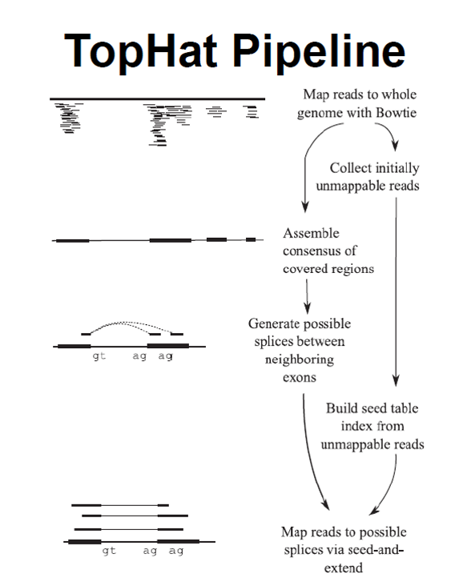
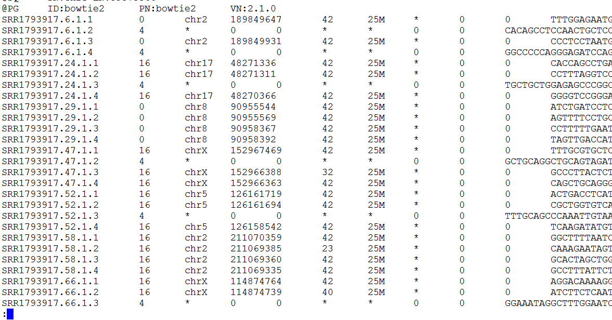
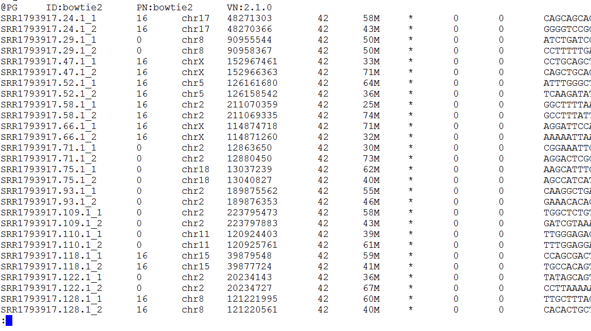

# Tophat-discovering-splice-junctions
Python implementation of Tophat algorithms that discovering splice junctions with RNA-Seq

This is the course project for Bioinformatics(BI3204 2016.02-2016.06) at [SUSTC](http://www.sustc.edu.cn/).

## Introduction to Tophat algorithms


after mapping RNA sequencing reads to whole genome with Bowtie, some reads are unmappable because they span two or more exons within the transcriptome. 
Here we use tophat algorithms firstly cut each of those unmappable reads into four parts, for example, 
an unmappable reads is 100 base pair long, we cut this reads into 1-25, 26-50, 51-75, 76-100 four parts by its sequence. Then, we map those cutted reads to whole genome with Bowtie. Finally, we find the splice junctions via seed and extend those cutted and mapped reads

## Tophat Alignment implementation in python: For human genome

```bash
python tophat.py
# input file (cutted and mapped reads): SRR1793917_1_cut.sam 
# output file (reads split by splice junctions):　SRR1793917_1_split.sam
```
SRR1793917_1_cut.sam 


SRR1793917_1_split.sam

